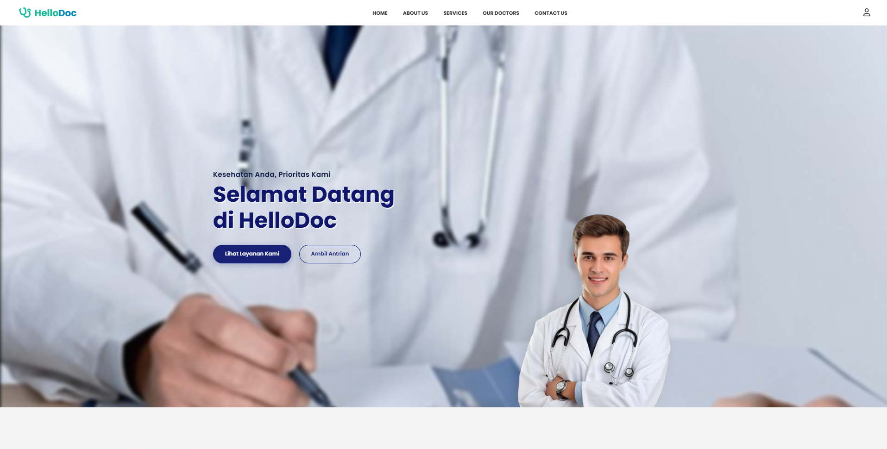
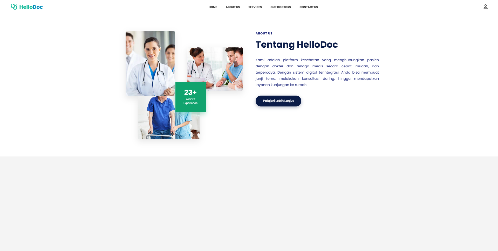
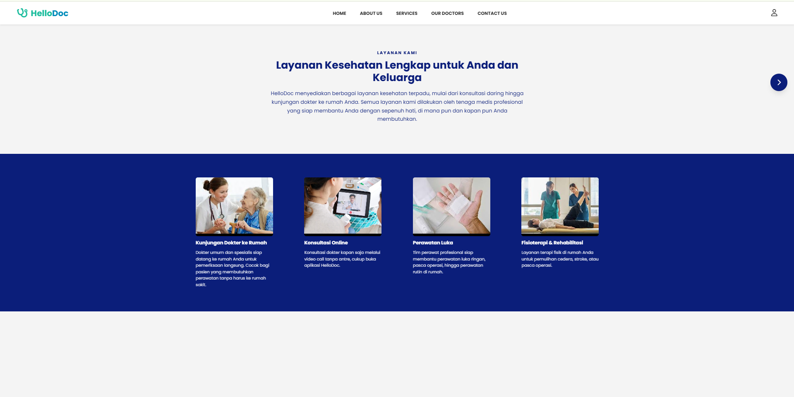
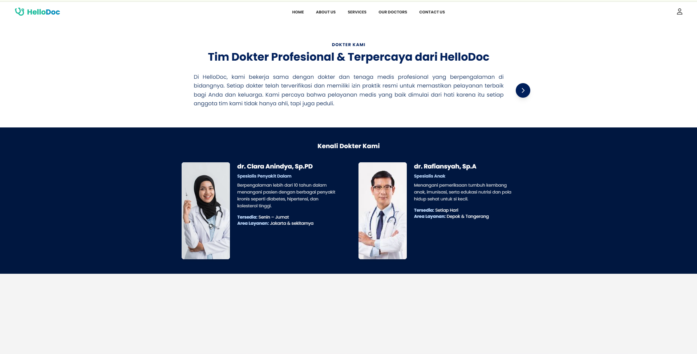

<!-- Gambar Tampilan Halaman Utama -->

  

  <b>Gambar 1.</b> Tampilan halaman utama website

<b>Penjelasan:</b> 
Halaman utama merupakan halaman awal yang ditampilkan ketika pengguna mengakses website.
Pada halaman ini terdapat informasi umum serta menu navigasi yang berfungsi untuk
memudahkan pengguna dalam mengakses fitur-fitur utama yang tersedia pada sistem.

<!-- Gambar Halaman About Us -->

  

  <b>Gambar 2.</b> Tampilan halaman About Us

<b>Penjelasan:</b> 
Halaman About Us merupakan halaman yang menampilkan informasi mengenai profil
platform HelloDoc. Halaman ini menjelaskan tujuan website, layanan kesehatan yang
disediakan, serta pengalaman dalam bidang pelayanan medis digital untuk
meningkatkan kepercayaan pengguna.

<!-- Gambar Tampilan Halaman Services -->
<!-- Gambar Tampilan Halaman Services -->

  

  <b>Gambar 3.</b> Tampilan halaman Services

<b>Penjelasan:</b> 
Halaman Services merupakan halaman yang menampilkan berbagai layanan kesehatan
yang disediakan oleh platform HelloDoc. Pada halaman ini pengguna dapat melihat
jenis layanan seperti kunjungan dokter ke rumah, konsultasi online, perawatan luka,
serta fisioterapi dan rehabilitasi. Informasi yang ditampilkan bertujuan untuk
memudahkan pengguna dalam memilih layanan kesehatan yang sesuai dengan
kebutuhan mereka.

<!-- Gambar Tampilan Halaman Our Doctors -->

  

  <b>Gambar 4.</b> Tampilan halaman Our Doctors

<b>Penjelasan:</b> 
Halaman Our Doctors merupakan halaman yang menampilkan daftar dokter
profesional yang tergabung dalam platform HelloDoc. Pada halaman ini,
pengguna dapat melihat informasi penting mengenai dokter, seperti nama dokter,
spesialisasi, pengalaman kerja, serta foto dokter.

Halaman ini bertujuan untuk membantu pengguna dalam mengenal tenaga medis
yang tersedia sebelum menggunakan layanan kesehatan. Dengan adanya halaman
Our Doctors, pengguna dapat memilih dokter yang sesuai dengan kebutuhan medis
dan merasa lebih percaya dan nyaman saat melakukan konsultasi atau perawatan
melalui platform HelloDoc.

<!-- Gambar Tampilan Halaman antrian -->

  

  <b>Gambar 5.</b> Tampilan halaman antrian

<b>Penjelasan:</b> 
pada halaman home terdapat ambil antrian,nah sebelum pasien mengambil antrian maka akan diarahkan ke halaman berikut

<!-- Gambar Tampilan Halaman login -->

  

  <b>Gambar 6.</b> Tampilan halaman login

<b>Penjelasan:</b> 
sebelum pasien mengambil antrian pasien harus melakukan login terlebih dahulu

## About Laravel

Laravel is a web application framework with expressive, elegant syntax. We believe development must be an enjoyable and creative experience to be truly fulfilling. Laravel takes the pain out of development by easing common tasks used in many web projects, such as:

- [Simple, fast routing engine](https://laravel.com/docs/routing).
- [Powerful dependency injection container](https://laravel.com/docs/container).
- Multiple back-ends for [session](https://laravel.com/docs/session) and [cache](https://laravel.com/docs/cache) storage.
- Expressive, intuitive [database ORM](https://laravel.com/docs/eloquent).
- Database agnostic [schema migrations](https://laravel.com/docs/migrations).
- [Robust background job processing](https://laravel.com/docs/queues).
- [Real-time event broadcasting](https://laravel.com/docs/broadcasting).

Laravel is accessible, powerful, and provides tools required for large, robust applications.

## Learning Laravel

Laravel has the most extensive and thorough [documentation](https://laravel.com/docs) and video tutorial library of all modern web application frameworks, making it a breeze to get started with the framework. You can also check out [Laravel Learn](https://laravel.com/learn), where you will be guided through building a modern Laravel application.

If you don't feel like reading, [Laracasts](https://laracasts.com) can help. Laracasts contains thousands of video tutorials on a range of topics including Laravel, modern PHP, unit testing, and JavaScript. Boost your skills by digging into our comprehensive video library.

## Laravel Sponsors

We would like to extend our thanks to the following sponsors for funding Laravel development. If you are interested in becoming a sponsor, please visit the [Laravel Partners program](https://partners.laravel.com).

### Premium Partners

- **[Vehikl](https://vehikl.com)**
- **[Tighten Co.](https://tighten.co)**
- **[Kirschbaum Development Group](https://kirschbaumdevelopment.com)**
- **[64 Robots](https://64robots.com)**
- **[Curotec](https://www.curotec.com/services/technologies/laravel)**
- **[DevSquad](https://devsquad.com/hire-laravel-developers)**
- **[Redberry](https://redberry.international/laravel-development)**
- **[Active Logic](https://activelogic.com)**

## Contributing

Thank you for considering contributing to the Laravel framework! The contribution guide can be found in the [Laravel documentation](https://laravel.com/docs/contributions).

## Code of Conduct

In order to ensure that the Laravel community is welcoming to all, please review and abide by the [Code of Conduct](https://laravel.com/docs/contributions#code-of-conduct).

## Security Vulnerabilities

If you discover a security vulnerability within Laravel, please send an e-mail to Taylor Otwell via [taylor@laravel.com](mailto:taylor@laravel.com). All security vulnerabilities will be promptly addressed.

## License

The Laravel framework is open-sourced software licensed under the [MIT license](https://opensource.org/licenses/MIT).
